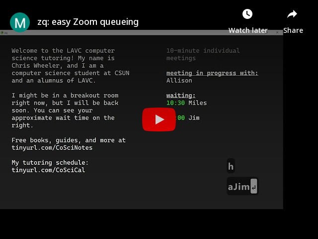

# zq

Easy Zoom queueing.

Some meeting waitlists are confusing and isolating for those waiting for help, but this queueing app makes it easy to immediately bring everyone into Zoom where they will see a welcome message and precise wait times. Depending on how you will use zq, you might find [this short guide](https://www.youtube.com/watch?v=2vAABLy7_q4) on how to open multiple Zooms helpful (the guide uses Windows but it also works for Macs and possibly Linux).

## features

* Simple controls with a smart queue. The timers automatically pause, unpause, or reset in many situations when they should.
* A sound notifies you when a timer has run out.
* Names and wait times are saved automatically so the app can be restarted any time if needed.
* Many intuitive keyboard shortcuts (see below), but you will probably only need a few of them.
* A clean look. No buttons on screen means no confusion for guests.
* Add style and color. In the settings you can change text style with HTML tags or like this: [b]this will be bold[/b] and [u]this will be underlined[/u], and you can change the color using [hex color codes](https://www.color-hex.com/) like this: [#00ff00]this text will be green[/], [#fa1a1a]this will be bright orange[/].

## download

Download zq here: https://github.com/wheelercj/zq/releases.

Currently, an installer is available only for Windows, but the source code runs on all major desktop platforms.

**installing from source**

1. Install [Python 3.10](https://www.python.org/downloads/release/python-3108/) if you haven't already.
2. Use `git clone https://github.com/wheelercj/zq.git` where you want the project's folder to appear.
3. If you want to use a virtual environment:
   1. `cd` into the new folder
   2. Create a virtual environment, such as with `py -3.10 -m venv venv` or `python3.10 -m venv venv`.
   3. [Activate the virtual environment](https://python.land/virtual-environments/virtualenv).
4. Use `pip install -r requirements.txt` to install the app's dependencies.
5. If you will edit the app, use `pip install -r requirements-dev.txt` to install the development dependencies.
6. If you will make commits, run `pre-commit install` to set up the git [pre-commit](https://pre-commit.com/) hooks.
7. Run the app with `py src/zq` or `python3 src/zq`.

## keyboard shortcuts

* `h` toggles keyboard shortcut help.
* `@` shows info about this app.
* `+` or `-` to increase or decrease font size.
* `o` opens the settings.
* `a` allows you to enter a student's name to add them to the queue.
* `n` brings the next student to the front of the queue, and rotates the previously front student to the end.
* `z` undoes the previous `n` keypress.
* `!` removes the last student in the queue.
* `?` removes a student from the queue by name.
* `b` adds a 5-minute break to the end of the queue.
* `$` randomizes the order of the queue.
* `m` toggles the meeting mode between group and individual meetings.
* `home` changes the meeting mode to display a message saying tutoring hours will start soon.
* `end` changes the meeting mode to display a message saying tutoring hours will soon end.
* `k` or `space` pauses/unpauses the individual meetings timer.
* `j` adds 5 seconds to the individual meetings timer.
* `l` subtracts 5 seconds from the individual meetings timer.
* `left arrow` adds 30 seconds to the individual meetings timer.
* `right arrow` subtracts 30 seconds from the individual meetings timer.
* `r` resets the individual meetings timer.
* `d` allows you to change the individual meetings duration (in minutes).
* `Ctrl/Cmd+w` closes the app.
* `F11` toggles fullscreen.
