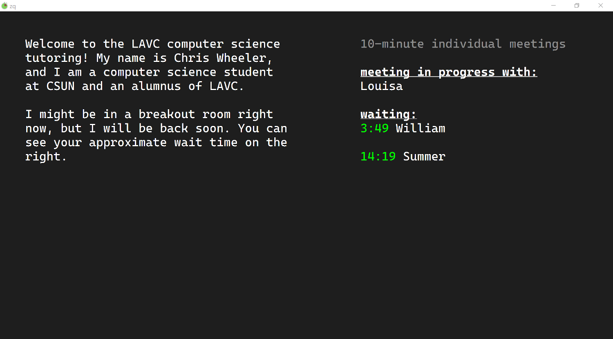

# zq

Easy Zoom queueing.

Some meeting waitlists are confusing and isolating for those waiting for help, but this queueing app makes it easy to immediately bring everyone into Zoom where they will see a welcome message and approximate wait times. zq only runs locally, so the user's screen must stay shared for others to see the queue.

## features

* Simple controls with a smart queue. For example, the timers automatically pause, unpause, or reset in many situations when they should.
* A sound notifies you when a timer has run out.
* Names and wait times are saved automatically so the app can be restarted any time if needed.
* Many intuitive keyboard shortcuts (see below), but you will probably only need a few of them.
* A clean look. No buttons on screen means no confusion for guests.
* Customize the color of text with [hex color codes](https://www.color-hex.com/) like this: [#00ff00]green[/#00ff00], [#00ffff]cyan[/#00ffff], [#fa1a1a]bright orange[/#fa1a1a].

## usage

This app is currently only being provided as source code. With Python on your device, you can download the source code, install the dependencies with `pip install -r requirements.txt`, and then run zq with the terminal command `python3 main.py` for Mac or Linux or `py main.py` for Windows while in the app's folder. This runs the TUI version of the app; to run the GUI version, use `python3 main.py gui` or `py main.py gui`. If you will use this often, you might want to [create your own terminal command](https://wheelercj.github.io/notes/pages/20220320181252.html) to make running zq easier.

## keyboard shortcuts

* `h` toggles keyboard shortcut help.
* `@` shows info about this app.
* `Ctrl` (or `Cmd`) and `+` or `-` to increase or decrease font size. Some terminals don't support this.
* `o` opens the settings. Restart to apply changes.
* `a` allows you to enter a student's name to add them to the queue.
* `n` brings the next student to the front of the queue, and rotates the previously front student to the end.
* `z` undoes the previous `n` keypress.
* `!` removes the last student in the queue.
* `?` removes a student from the queue by name.
* `b` adds a 5-minute break to the end of the queue.
* `$` randomizes the order of the queue.
* `m` toggles the meeting mode between group and individual meetings.
* `home` changes the meeting mode to display a message saying tutoring hours will start soon.
* `end` changes the meeting mode to display a message saying tutoring hours will soon end.
* `k` or `space` pauses/unpauses the individual meetings timer.
* `j` adds 5 seconds to the individual meetings timer.
* `l` subtracts 5 seconds from the individual meetings timer.
* `left arrow` adds 30 seconds to the individual meetings timer.
* `right arrow` subtracts 30 seconds from the individual meetings timer.
* `r` resets the individual meetings timer.
* `d` allows you to change the individual meetings duration (in minutes).
* `s` saves student info; for if you have autosave disabled.

## third-party dependencies

* [PySide6](https://www.qt.io/qt-for-python) for the graphical user interface
* [Textual](https://github.com/Textualize/textual) for the text user interface
* [Rich](https://github.com/Textualize/rich), which is used by Textual
* [chime](https://pypi.org/project/chime/) for notification sounds when a timer runs out
